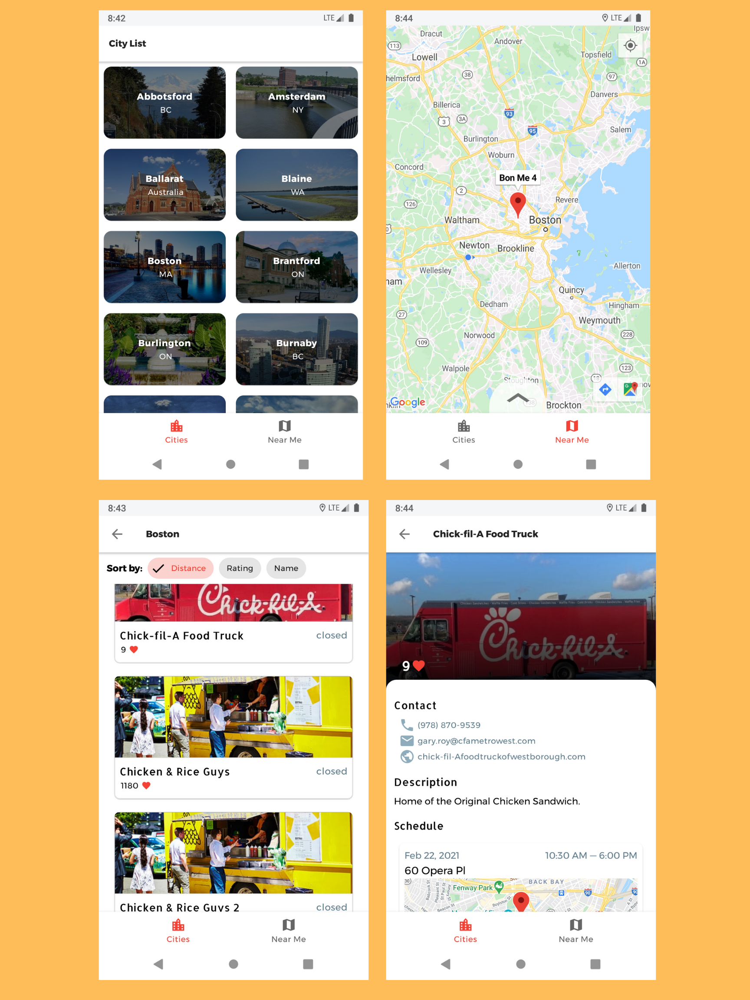

# FoodTrck


## About
An app that gets a list of foodtrucks from <a href="https://streetfoodapp.com/api"> StreetFoodApp.com API </a>, and displays them conveniently. Conversely, the user can choose to see markers of nearby foodtrucks. 

<p align="center">  </p>

##
<p align="center"></p>

## Installation
Clone this repository and import into **Android Studio**
```bash
git clone https://github.com/axk4647/FoodTrck.git
```

## Prerequisites 

To build the project successfully you will need to create a ```apikey.properties``` file and include the following lines with your ```MAPS SDK for Android API KEY``` 
```
GOOGLE_MAPS_API_KEY=XXXXXXXXXXXXXXXXXXXXX_XXXXXXXXXXXXXXXXX
```

## Overview
* Gradle Kotlin is used setting up gradle files with buildSrc folder and extensions.
* Hilt for dependency injection
* Android architecture components to manage lifecycles
* Coroutines and flow to manage asynchronous programming
* Repository provides offline and remote data sources via retrofit and room 
* Adheres to MVVM architectural patterns


## Libraries 
* [Kotlin](https://kotlinlang.org/) - First class and official programming language for Android development.

* [Coroutines](https://kotlinlang.org/docs/reference/coroutines-overview.html) - Threads on steroids for Kotlin
* [Flow](https://kotlin.github.io/kotlinx.coroutines/kotlinx-coroutines-core/kotlinx.coroutines.flow/-flow/) - A cold asynchronous data stream that sequentially emits values and completes normally or with an exception.
* [Android JetPack](https://developer.android.com/jetpack) - Collection of libraries that help you design robust, testable, and maintainable apps.
  * [LiveData](https://developer.android.com/topic/libraries/architecture/livedata) - Data objects that notify views when the underlying database changes.
  * [ViewModel](https://developer.android.com/topic/libraries/architecture/viewmodel) - Stores UI-related data that isn't destroyed on UI changes.
  * [DataBinding](https://developer.android.com/topic/libraries/data-binding) - Generates a binding class for each XML layout file present in that module and allows you to more easily write code that interacts with views.
  * [SavedStateHandle](https://developer.android.com/reference/androidx/lifecycle/SavedStateHandle) A handle to saved state passed down to androidx.lifecycle.ViewModel. You should use SavedStateViewModelFactory if you want to receive this object in ViewModel's constructor.
  * [Room](https://developer.android.google.cn/jetpack/androidx/releases/room) Persistence library provides an abstraction layer over SQLite to allow for more robust database access while harnessing the full power of SQLite.
* [Material Components for Android](https://github.com/material-components/material-components-android) - Modular and customizable Material Design UI components for Android.
* [Dependency Injection](https://developer.android.com/training/dependency-injection) -
  * [Hilt](https://dagger.dev/hilt/) - Standard library to incorporate Dagger dependency injection into an Android application.
  * [Hilt-ViewModel](https://developer.android.com/training/dependency-injection/hilt-jetpack) - DI for injecting `ViewModel`.
* [Retrofit](https://square.github.io/retrofit/) - A type-safe HTTP client for Android and Java.
* [Glide](https://github.com/bumptech/glide) - Image loading library.
* [Espresso](https://developer.android.com/training/testing/espresso) - Android UI Tests
* [JUnit](https://junit.org/junit5/) - Unit testing
* [Mockito](https://github.com/mockito/mockito) - Mocking framework

## APIS
<a href="https://streetfoodapp.com/api">Street Food API</a>

<a href="https://developers.google.com/maps/documentation/android-sdk/overview"> Google maps</a>

## Architecture


## Icon sources:

<a href="https://www.vecteezy.com/free-vector/illustration">Illustration Vectors by Vecteezy</a>

<a href="https://materialdesignicons.com/">Material Design Icons </a>

